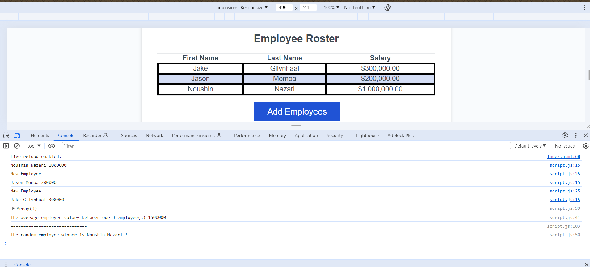

# payroll-tracker
This project is employee payroll tracker, through this assignment we are displayed with the following:

"WHEN one click the "Add employee" button, THEN he/she is presented with a series of prompts asking for first name, last name, and salary.
WHEN one finish adding an employee, THEN he/she is prompted to continue or cancel.
WHEN one choose to continue, THEN he/she is prompted to add a new employee.
WHEN one choose to cancel, THEN the employee data is displayed on the page sorted alphabetically by last name, and the console shows computed and aggregated data".

http://127.0.0.1:5500/index.html

gitHub: https://github.com/NoushinP/payroll-tracker.git

